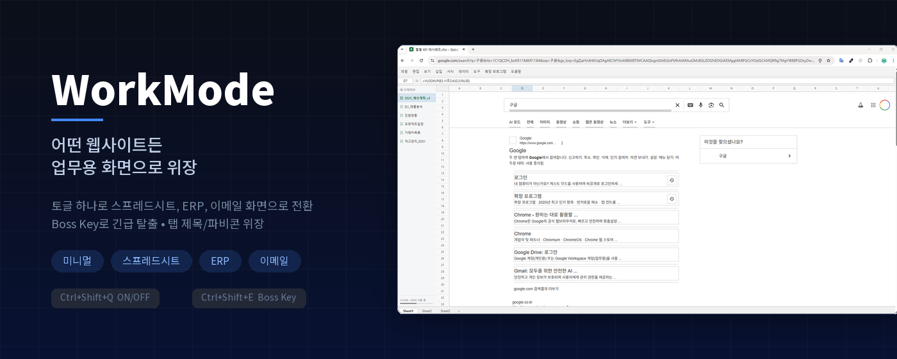
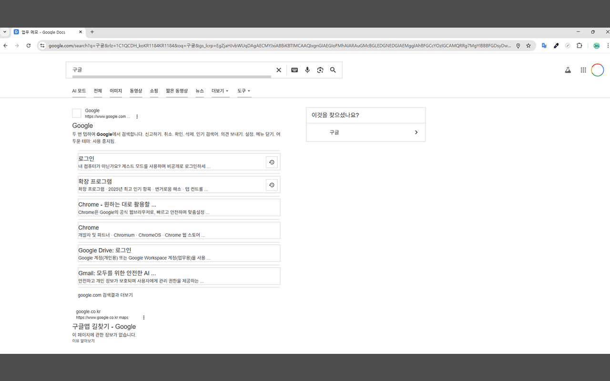
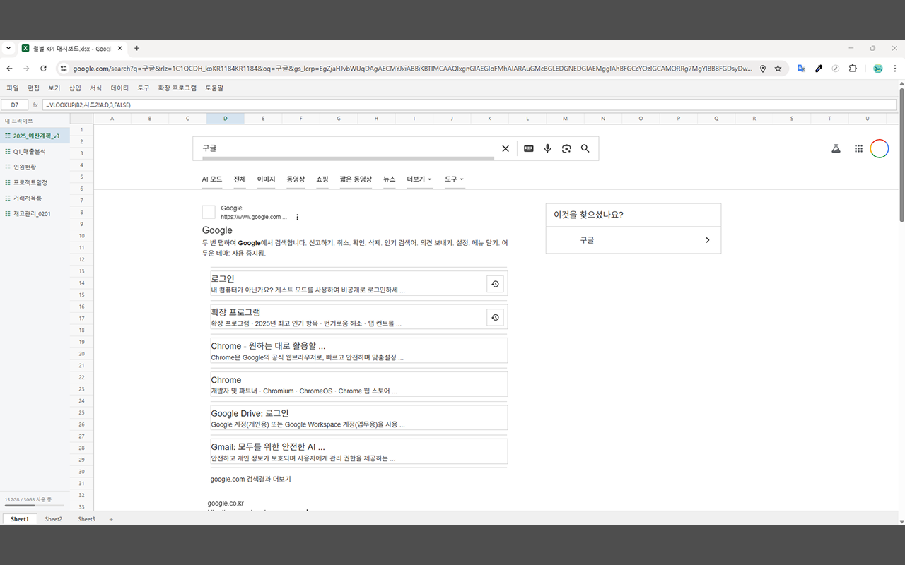
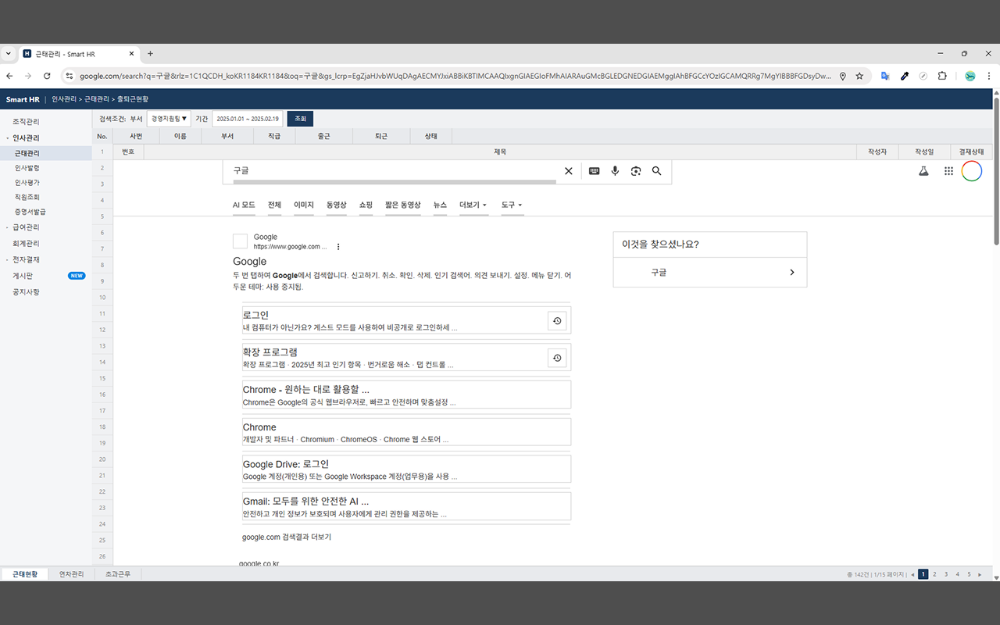
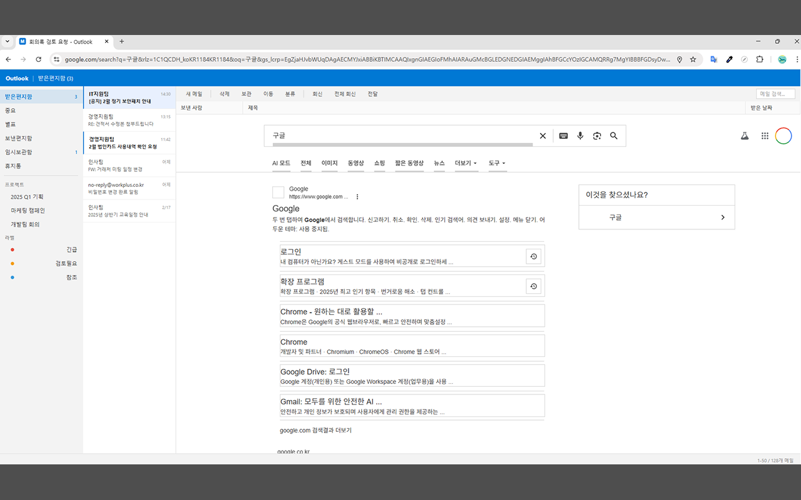

# WorkMode

> 열린 사무실에서 모니터 시선이 신경 쓰일 때 만든 크롬 익스텐션

아무 웹사이트나 토글 하나로 업무용 화면처럼 바꿔줍니다.
`Ctrl+Shift+Q` 한 번이면 스프레드시트 보는 것처럼 보입니다.

<p align="center">
  
</p>

---

## 테마 미리보기

<table>
  <tr>
    <td align="center"><strong>미니멀</strong><br>프레임 없이 콘텐츠만 중립화</td>
    <td align="center"><strong>스프레드시트</strong><br>Excel/Google Sheets 느낌</td>
  </tr>
  <tr>
    <td></td>
    <td></td>
  </tr>
  <tr>
    <td align="center"><strong>ERP</strong><br>사내 ERP 시스템 느낌</td>
    <td align="center"><strong>이메일</strong><br>Outlook 느낌</td>
  </tr>
  <tr>
    <td></td>
    <td></td>
  </tr>
</table>

---

## 주요 기능

- **콘텐츠 중립화** — 페이지의 색상을 무채색으로 바꾸고 이미지/동영상/이모지를 숨김
- **테마 위장** — 4가지 테마로 페이지를 업무용 화면처럼 위장
- **탭 위장** — 탭 제목과 파비콘도 변경 (ON/OFF 가능)
- **Boss Key** — `Ctrl+Shift+E`로 설정한 URL로 즉시 이동
- **사이트별 제외** — 특정 사이트에서는 WorkMode 비활성화 가능
- **반응형 오버레이** — 좁은 화면에서 사이드바 자동 축소/숨김

### 단축키

| 단축키 | 기능 |
|--------|------|
| `Ctrl+Shift+Q` | WorkMode ON/OFF |
| `Ctrl+Shift+E` | Boss Key (긴급 탈출) |

---

## 설치

### 크롬 웹 스토어
아직 심사 중... (업데이트 예정)

### 직접 설치 (개발용)

```bash
git clone https://github.com/won-ee/WorkMode.git
cd WorkMode
npm install
npm run build
```

1. 크롬에서 `chrome://extensions` 접속
2. 오른쪽 상단 `개발자 모드` ON
3. `압축해제된 확장 프로그램을 로드합니다` 클릭
4. `dist` 폴더 선택

---

## 사용법

1. 확장 프로그램 아이콘 클릭해서 팝업 열기
2. 토글 ON으로 WorkMode 활성화
3. 원하는 테마 선택
4. 필터(이미지/동영상/이모지/탭 위장) ON/OFF 조절

---

## 기술 스택

- TypeScript
- Vite (빌드)
- Chrome Extension Manifest V3

별도 프레임워크 없이 바닐라 TS로 작성했습니다.

## 프로젝트 구조

```
src/
├── background/        # service worker
├── content/           # content script (페이지에 주입)
│   ├── styles/        # CSS (base, hide-images, hide-videos)
│   ├── inject.ts      # 메인 진입점
│   ├── tab-disguise.ts
│   ├── media-hider.ts
│   ├── spreadsheet-overlay.ts
│   ├── erp-overlay.ts
│   └── email-overlay.ts
├── popup/             # 팝업 UI
├── utils/             # 상수, 메시징, 스토리지
└── manifest.json
```

## 빌드

```bash
# 개발 (watch 모드)
npm run dev

# 프로덕션 빌드
npm run build

# 배포용 zip
npm run zip
```

## 개인정보처리방침

[Privacy Policy](PRIVACY.md)

## 라이선스

MIT
